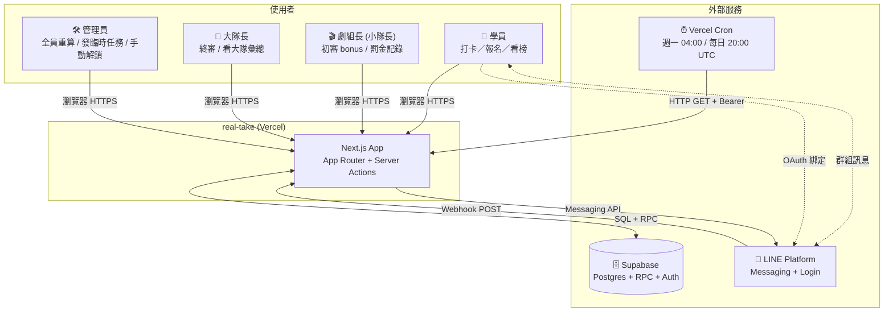
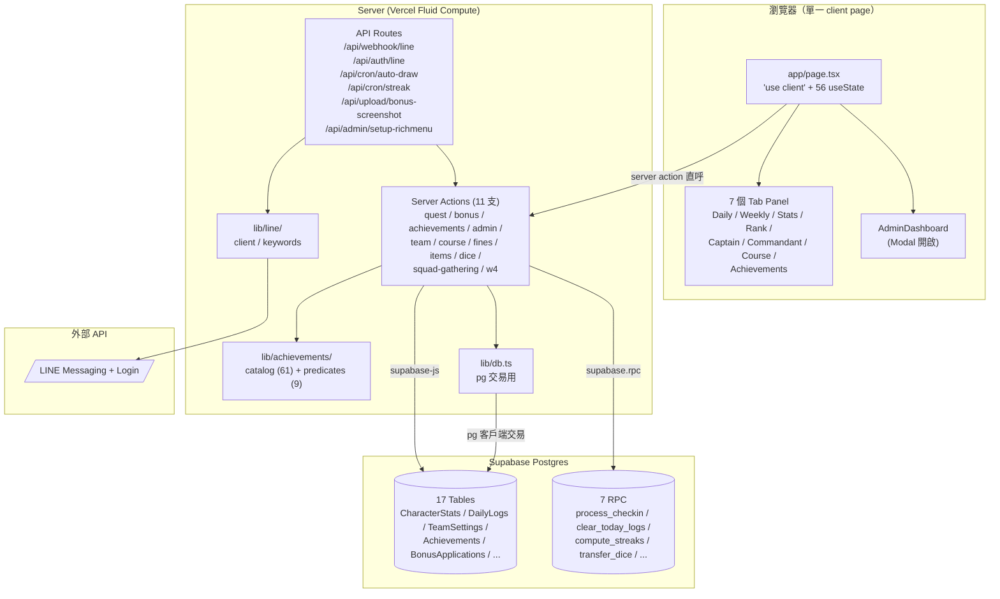
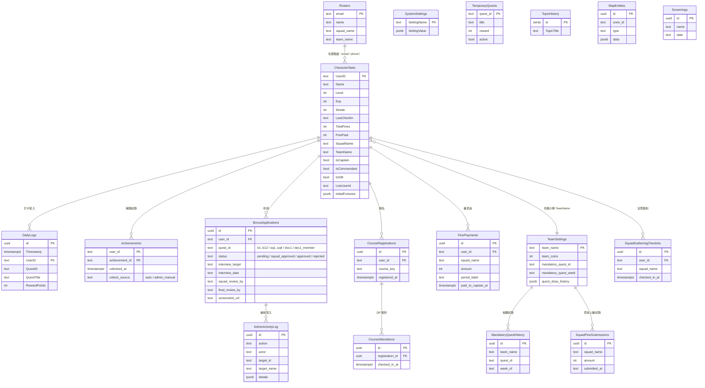
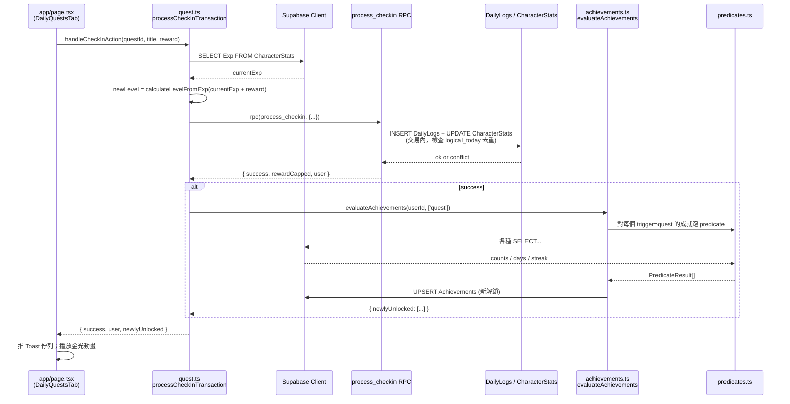
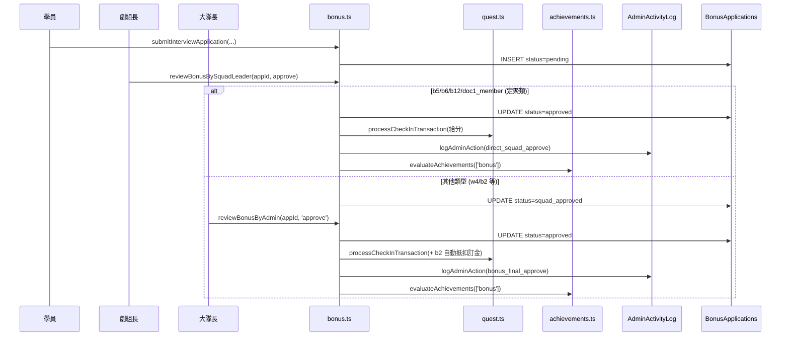
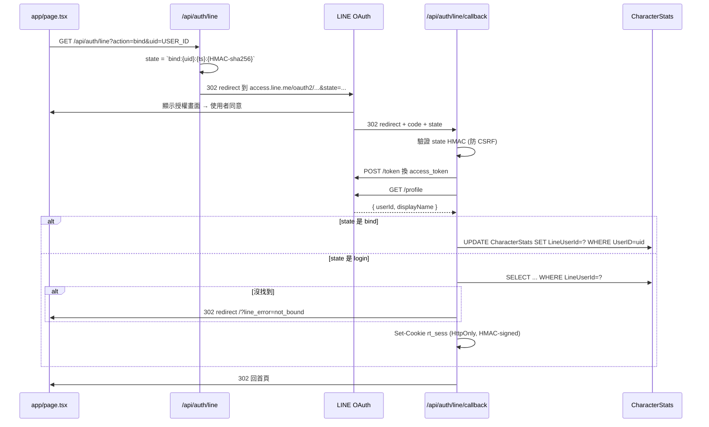
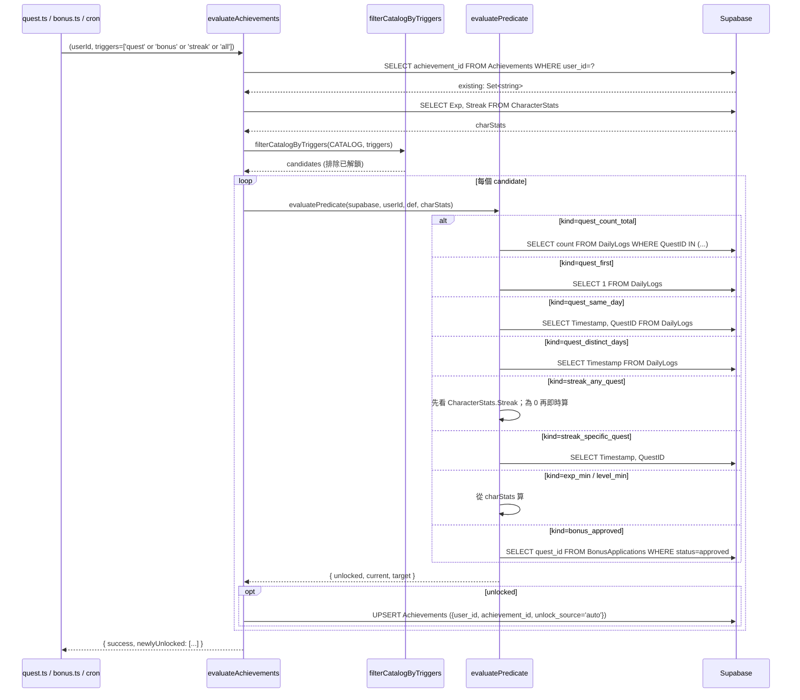
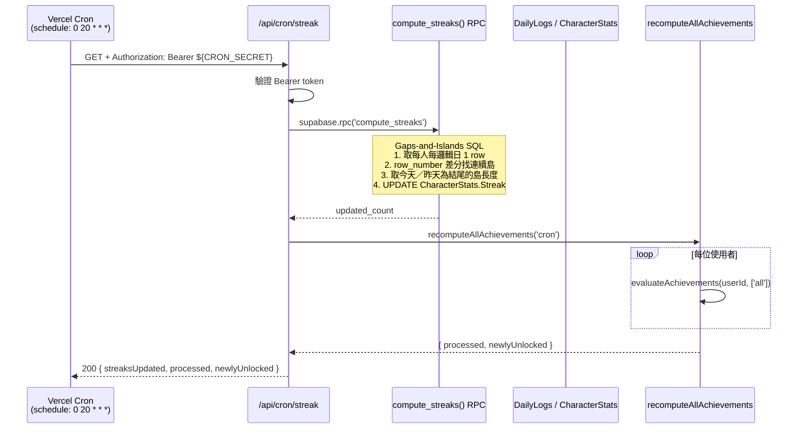
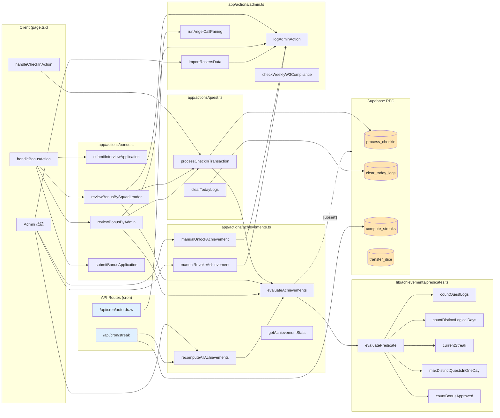

# real-take 系統架構文件

> **這份文件服務於「接手維運／交接」的工程師。**
> 重點不是重複 [GAME_DESIGN.md](GAME_DESIGN.md) 的業務規格，而是回答：這東西怎麼運作、為什麼這樣設計、哪裡容易出事、要改什麼得動哪些檔案。
>
> 若你只有 30 分鐘，請先讀完 §0 TL;DR 與 §9 維運 Playbook。其餘可按需查閱。

---

## §0 TL;DR — 30 秒版本

real-take（專案代號「大方圓開運親證班：這不是電影」）是一個為期11週（2026/05/04–2026/07/20）的遊戲化打卡系統，服務對象是「大方圓體系」開運親證班的學員。

- **技術堆疊**：Next.js 15 App Router（`'use client'` 單頁 + Server Actions）+ Supabase Postgres + LINE Bot/Login + Vercel Fluid Compute。
- **壓力點**：巨型單頁 [app/page.tsx](../app/page.tsx)（56+ useState），13 份 server actions，17 張 DB 表，雙資料庫客戶端（`pg` 管交易、`@supabase/supabase-js` 管讀與 RPC），以及最近交付的 **61 個成就**系統（9 種 predicate）。
- **Day 1 必讀清單**：
  - [CLAUDE.md](../CLAUDE.md) — 專案規則與慣例
  - [docs/GAME_DESIGN.md](GAME_DESIGN.md) — 業務規格
  - [app/page.tsx](../app/page.tsx) — 前端全貌
  - [app/actions/quest.ts](../app/actions/quest.ts) — 最核心的打卡流程
  - [lib/achievements/catalog.ts](../lib/achievements/catalog.ts) — 61 筆成就定義

---

## §1 系統定位與業務背景

本系統的服務對象是每年 5–7 月實體開課的「親證班」學員（約數百人）。學員需要在 2-3 個月內完成每日定課、週任務、雙週主題作業、聯誼會／傳愛等多項活動；同時維運單位需要：集中稽核、計算罰金、抽籤分組、課程報名簽到、從 LINE 群組自動收稿「親證」心得卡。系統把這些整合到單一網站（響應式，手機優先）。

系統對應的七個 tab 採「電影片廠」隱喻：`daily(每日觀影)`、`weekly(導演報表)`、`stats(觀影分析)`、`rank(票房榜)`、`captain(製片總部)`、`commandant(片商總部)`、`course(首映曆)`，另有 `achievements(片廠榮耀)` 近期新增。

**關鍵非功能性需求**：

1. **手機優先**：90% 以上使用者在手機打卡，所有互動元件需 ≥ 44px 觸控區；避免桌面慣用的 hover／悬停。
2. **LINE 生態整合**：學員透過 LINE OAuth 登入綁定；LINE Bot 提供關鍵字查詢教學回覆（`/打卡`、`/週任務`…）。
3. **可稽核**：所有管理員與劇組長（隊長）動作都寫入 `AdminActivityLog`，便於事後查核。
4. **零運維**：部署 Vercel Fluid Compute，不維護自管伺服器；資料庫用 Supabase。
5. **活動期間容錯大於精準**：允許即時取消、補交、重算；寧可讓管理員有能力修正，也不追求即時 100% 正確。

---

## §2 系統架構（C4 Context + Container）

### 2.1 Mermaid 圖 A — C4 Context（系統邊界與外部關係）



**關鍵外部邊界**：

- **LINE webhook**（`POST /api/webhook/line`）：每條群組訊息都會打進來，signature 用 `LINE_CHANNEL_SECRET` 驗證；通過後比對 `/` 開頭的關鍵字（如 `/打卡`、`/週任務`），命中則回覆說明文字。
- **LINE Login OAuth**：`/api/auth/line?action=login|bind` → 轉跳 LINE → callback 建帳號或綁 LINE ID。`bind` 模式用 HMAC 簽名 state 防止 CSRF。
- **Vercel Cron**：兩個 job — 週一 04:00 UTC 執行「天使通話配對」（`runAngelCallPairing`），每日 20:00 UTC（= 台灣 04:00）執行「Streak 重算 + 全員成就重算」。所有 cron 端點都以 `Bearer ${CRON_SECRET}` 驗證。

### 2.2 Mermaid 圖 B — C4 Container（內部模組分解）



**設計決策記錄**：

- **為什麼維持單一 `'use client'` page？** 此系統的互動核心（打卡）牽扯到大量跨 tab 的共享狀態（CharacterStats、DailyLogs、TeamSettings、BonusApplications、成就列表…），拆路由要嘛每頁重新拉資料，要嘛引入 Zustand／Jotai。早期為了壓縮交付時間選擇「全塞一頁 + server actions」，至今 1 萬行以內仍可維護。**若要拆**，建議先把 admin 後台抽成 `/admin` 路由並用 server components 初始化資料。
- **為什麼有兩套資料庫客戶端？**
  - `@supabase/supabase-js`（大多數地方）：RLS 自動套、有 RPC 介面、寫起來快。
  - `pg`（[lib/db.ts](../lib/db.ts)，僅 [app/actions/admin.ts](../app/actions/admin.ts) 內的 `importRostersData` 等批次寫入使用）：supabase-js 不支援顯式 `BEGIN/COMMIT/ROLLBACK`，一次改數百筆的 Roster 匯入需要原子性，只能用 `pg` 或走 RPC。打卡的原子性則搬到 SQL 函式 `process_checkin` 解決。
- **為什麼多處把互斥／去重規則寫在 SQL RPC 而不是 Server Action？** Server Action 裡用 JS 寫「先 SELECT 再 INSERT」會有 race condition（同一學員連點兩次打卡按鈕）。把互斥規則寫進 `process_checkin` RPC，交易邊界內讀寫一致，兼顧效能。

---

## §3 目錄結構總覽

```
real-take/
├── app/
│   ├── page.tsx                    # 巨型 client page；所有 tab 共享狀態
│   ├── layout.tsx                  # 全域 layout
│   ├── actions/                    # Server Actions（業務邏輯入口）
│   │   ├── quest.ts                # 打卡主流程 + 成就評估呼叫
│   │   ├── bonus.ts                # b1–b12/sq/doc1 申請＋審核
│   │   ├── achievements.ts         # 成就求值／手動解鎖／重算／統計
│   │   ├── admin.ts                # 管理員動作（roster 匯入、天使配對…）
│   │   ├── team.ts                 # 小隊推薦定課抽籤、票房榜資料
│   │   ├── course.ts               # 課程報名與簽到
│   │   ├── fines.ts                # 罰金計算與上繳
│   │   ├── squad-gathering.ts      # 小隊定聚打卡
│   │   ├── dice.ts                 # 骰子轉移（舊版）
│   │   ├── items.ts                # 道具購買（舊版）
│   │   └── w4.ts                   # bonus.ts 的歷史別名，待刪
│   ├── api/
│   │   ├── webhook/line/           # LINE Bot webhook（POST）
│   │   ├── auth/line/              # LINE Login OAuth（GET + callback）
│   │   ├── cron/auto-draw/         # 週一 cron — 天使通話配對
│   │   ├── cron/streak/            # 每日 cron — Streak + 成就重算
│   │   ├── upload/bonus-screenshot/ # 聯誼會截圖上傳
│   │   └── admin/setup-richmenu/   # LINE Rich Menu 建置
│   └── class/                      # 舊版課程頁（legacy，仍可用）
├── components/
│   ├── Tabs/                       # 7 個 tab 對應元件（+ AchievementsTab）
│   ├── Admin/                      # AdminDashboard + AchievementsPanel
│   ├── Login/                      # 登入／註冊／LINE 綁定
│   ├── Layout/                     # Header / 通用容器
│   └── ui/                         # 純展示（Badge, Toast, Modal…）
├── lib/
│   ├── constants.tsx               # 全域常數：ZONES, 定課清單, calculateLevelFromExp, ...
│   ├── db.ts                       # pg 客戶端（交易用）
│   ├── courseConfig.ts             # 課程報名時段／QR code 設定
│   ├── utils/time.ts               # getLogicalDateStr, getWeeklyMonday, 雙週主題
│   ├── line/                       # LINE Bot SDK wrappers（client + 關鍵字回覆）
│   └── achievements/
│       ├── catalog.ts              # 61 筆成就靜態定義（source of truth）
│       └── predicates.ts           # 9 種 predicate 查詢實作
├── supabase/migrations/            # DB schema migration + RPC（按日期命名）
├── scripts/                        # 一次性修資料／遷移腳本（npx ts-node 執行）
├── public/achievements/            # 1.png ~ 61.png 成就圖
└── docs/                           # 本文件所在處
```

**資料夾角色口訣**：
`app/` 路由與邏輯入口 → `components/` 展示 → `lib/` 純函式 → `supabase/` 結構定義 → `scripts/` 一次性工具。

---

## §4 資料模型（ER 圖）

### 4.1 Mermaid 圖 C — ER 圖（關鍵表與關聯）



### 4.2 重要概念

**Logical Date（邏輯日）** — [lib/utils/time.ts](../lib/utils/time.ts) `getLogicalDateStr`：
每日的「一天」切在台灣時間中午 12:00，12:00 前都算前一天。原因：學員可能晚上 11:55 打卡、凌晨 0:10 又打卡，業務上希望這兩筆算同一天。**所有的 daily 去重、streak 計算、同日 3 定課成就都必須用邏輯日**。DB 端的 RPC（如 `process_checkin`, `compute_streaks`）也用相同規則。

**QuestID 命名規則**：

| 前綴 | 含義 | 範例 | 去重規則 |
|------|------|------|------|
| `q1` / `q1_dawn` | 體運定課／破曉體運定課 | — | 同日互斥；兩者計為同一種，當日已有任一筆即封鎖 |
| `q2`–`q22` | 任意定課（flex quest） | `q3`, `q7` | 同種每日最多 1 次；不同種同日最多 **3 種**（共用上限） |
| `r1` | 關係定課 | `r1` | 同邏輯日最多 **3 筆**（每位互動對象各算 1 筆） |
| `a1` | 天使通話 | `a1` | 每週至少 1 次，無次數上限 |
| `w1`–`w2` | 週任務（親證分享／欣賞夥伴） | `w1\|2026-05-11` | 每週 1 次 |
| `w3`–`w4` | 月任務（小隊定聚／小隊通話） | `w3\|2026-05-11` | **每月最多 2 次** |
| `t1`/`t2`/`t3` | 雙週主題親證 | `t2`, `t3_forrest` | 視主題期 |
| `sq1`–`sq4` | 小隊定聚主題 | — | bonus 流程 |
| `b1`–`b12` | 加分申請 | `b2\|2026-04-18\|對象` | bonus 流程 |
| `doc1`, `doc1_member` | 紀錄片主＋參與 | — | bonus 流程 |
| `temp_*` | 管理員臨時任務 | `temp_17114\|2026-04-18` | 各自規定 |

**為什麼 `Level` 不持久化？** [lib/constants.tsx](../lib/constants.tsx) `calculateLevelFromExp` 由 `Exp` 推導（線性 + 上限 99）。寫在前端讓管理員調整公式時不必做 DB migration。缺點是 DB 端若要篩「Level ≥ 50」必須計算 Exp 門檻；predicate `level_min` 在伺服器端也呼叫同一支公式。

**`Achievements` 表欄位名是 snake_case（`user_id`, `achievement_id`, `unlocked_at`, `unlock_source`）**，不同於其他表的 PascalCase — 是新系統，未來拓展可延用此風格。`achievement_id` 雖對應數字 1..61，但 DB 存字串避免 PK/FK 型別衝突。

---

## §5 業務流程 Sequence 圖

### 5.1 Mermaid 圖 D — 學員打卡流程



**重點**：

- 打卡的原子性完全交給 `process_checkin` RPC，Server Action 只負責傳參與事後的成就評估。
- 成就評估失敗**不會**讓打卡回滾（[app/actions/quest.ts:60-64](../app/actions/quest.ts) `try/catch swallow`），因此管理員需要手動觸發「全員重算」修復漏解鎖。
- 前端 `handleCheckInAction` 把 `newlyUnlocked` 推入 Toast 佇列，多個同時解鎖時逐個播放。

### 5.2 Mermaid 圖 E — Bonus 申請／審核流程



**重點**：

- 兩類申請：定聚類（b5/b6/b12/doc1_member）劇組長一審即入帳；其餘需大隊長終審。
- `b2` 完款審核時會自動查 `b1` 訂金紀錄，若有則抵扣 1000 差額（[app/actions/bonus.ts:235-248](../app/actions/bonus.ts)）。
- 每次審核都寫 `AdminActivityLog`（供稽核），再呼叫 `evaluateAchievements(['bonus'])` 觸發相關成就（#33–#36, #42, #48, #55, #57 等）。

### 5.3 Mermaid 圖 F — LINE OAuth 綁定流程



**重點**：

- `action=bind` 與 `action=login` 的 `state` 都用 `LINE_LOGIN_CHANNEL_SECRET` 做 HMAC 簽名（10 分鐘 TTL），避免 CSRF / replay。login flow 成功後改以 **HttpOnly signed cookie**（`rt_sess`）帶 UserID，不再把 UserID 放 URL query，可用 `GET /api/auth/me` 換取。
- Webhook 則用另一組 secret（`LINE_CHANNEL_SECRET`）驗證 `x-line-signature` header（[app/api/webhook/line/route.ts:15-19](../app/api/webhook/line/route.ts)）。
- LINE 有兩個 channel：Login Channel + Messaging Channel。env 變數分得很開，別混用。

### 5.4 Mermaid 圖 G — 成就解鎖核心流程



**重點**：

- 9 種 predicate 分開實作，邏輯都在 [lib/achievements/predicates.ts](../lib/achievements/predicates.ts)。
- `streak_any_quest` 優先讀 `CharacterStats.Streak`（由每日 cron 填），為 0 才回退到即時計算。因此 cron 掉了會讓 streak 類成就延遲解鎖，但不會錯解。
- 上 61 個成就全部走同一路徑，沒有硬 coded 的特判。新增成就 → 往 `catalog.ts` 加一筆 + 一張 PNG 即可。

### 5.5 Mermaid 圖 H — 每日 Streak 重算 Cron



**Gaps-and-Islands SQL 在哪**：[supabase/migrations/202604180001_achievements_system.sql:31-93](../supabase/migrations/202604180001_achievements_system.sql)。核心想法是 `logical_date - ROW_NUMBER() OVER (ORDER BY logical_date)` 對連續日會得到同一個 grp 值，再 GROUP BY grp 拿到每段「島」的長度與結尾日期。

---

## §6 Function 呼叫關係圖

### 6.1 Mermaid 圖 I — Server Actions 核心呼叫圖



### 6.2 關鍵函式索引表

| 函式 | 路徑 | 職責 | 主要呼叫者 |
|------|------|------|--------|
| `processCheckInTransaction` | [app/actions/quest.ts](../app/actions/quest.ts) | 打卡主流程：呼叫 `process_checkin` RPC + 觸發成就 | page.tsx, bonus.ts |
| `clearTodayLogs` | [app/actions/quest.ts](../app/actions/quest.ts) | 清當天自己的 DailyLogs | page.tsx 除錯工具 |
| `evaluateAchievements` | [app/actions/achievements.ts](../app/actions/achievements.ts) | 成就求值入口（依 trigger 過濾） | quest.ts, bonus.ts, cron/streak |
| `manualUnlockAchievement` | [app/actions/achievements.ts](../app/actions/achievements.ts) | 管理員手動解鎖 | AchievementsPanel |
| `manualRevokeAchievement` | [app/actions/achievements.ts](../app/actions/achievements.ts) | 管理員撤銷 | AchievementsPanel |
| `recomputeAllAchievements` | [app/actions/achievements.ts](../app/actions/achievements.ts) | 全員重算（迭代 evaluateAchievements） | AchievementsPanel, cron/streak |
| `getAchievementStats` | [app/actions/achievements.ts](../app/actions/achievements.ts) | 各成就解鎖率統計 | AchievementsPanel |
| `evaluatePredicate` | [lib/achievements/predicates.ts](../lib/achievements/predicates.ts) | 9 種 predicate 分派 | achievements.ts |
| `filterCatalogByTriggers` | [lib/achievements/predicates.ts](../lib/achievements/predicates.ts) | trigger → 子集 catalog | achievements.ts |
| `submitInterviewApplication` | [app/actions/bonus.ts](../app/actions/bonus.ts) | 提交 b1/b2 電影推廣訪談 | page.tsx |
| `submitBonusApplication` | [app/actions/bonus.ts](../app/actions/bonus.ts) | 提交 b3–b12/sq/doc1 | page.tsx |
| `reviewBonusBySquadLeader` | [app/actions/bonus.ts](../app/actions/bonus.ts) | 劇組長初審（部分直接入帳） | page.tsx |
| `reviewBonusByAdmin` | [app/actions/bonus.ts](../app/actions/bonus.ts) | 大隊長終審 + b2 自動抵扣 | page.tsx |
| `logAdminAction` | [app/actions/admin.ts](../app/actions/admin.ts) | 寫 `AdminActivityLog` | 多處 |
| `checkWeeklyW3Compliance` | [app/actions/admin.ts](../app/actions/admin.ts) | 週合規檢查 → 罰金 | AdminDashboard |
| `importRostersData` | [app/actions/admin.ts](../app/actions/admin.ts) | CSV 匯入 `Rosters`（pg 交易） | AdminDashboard |
| `runAngelCallPairing` | [app/actions/admin.ts](../app/actions/admin.ts) | 天使通話配對 | cron/auto-draw |
| `drawWeeklyQuestForSquad` | [app/actions/team.ts](../app/actions/team.ts) | 小隊抽推薦定課 | CaptainTab |
| `autoDrawAllSquads` | [app/actions/team.ts](../app/actions/team.ts) | 全服自動抽（已無 cron 觸發） | AdminDashboard |
| `getSquadMembersStats` | [app/actions/team.ts](../app/actions/team.ts) | 本隊成員戰力 | CaptainTab |
| `registerForCourse` | [app/actions/course.ts](../app/actions/course.ts) | 課程報名產生 QR | CourseTab |
| `markAttendance` | [app/actions/course.ts](../app/actions/course.ts) | 志工掃 QR 簽到 | Scanner |
| `getSquadFineStatus` | [app/actions/fines.ts](../app/actions/fines.ts) | 本隊罰金狀態 | CaptainTab |
| `checkSquadFineCompliance` | [app/actions/fines.ts](../app/actions/fines.ts) | 每週自動判定未達標 | CaptainTab |
| `checkInToGathering` | [app/actions/squad-gathering.ts](../app/actions/squad-gathering.ts) | 定聚簽到 | CaptainTab |
| `getLogicalDateStr` | [lib/utils/time.ts](../lib/utils/time.ts) | 邏輯日計算（全域） | 幾乎所有 action |
| `calculateLevelFromExp` | [lib/constants.tsx](../lib/constants.tsx) | Exp→Level 線性公式 | 前端 + predicate |
| `process_checkin` | [supabase/migrations/202603270000_checkin_rpc.sql](../supabase/migrations/) | 打卡原子交易 | quest.ts |
| `clear_today_logs` | migrations | 清當日紀錄 | quest.ts |
| `compute_streaks` | [supabase/migrations/202604180001_achievements_system.sql](../supabase/migrations/202604180001_achievements_system.sql) | Gaps-and-Islands 算 Streak | cron/streak |
| `transfer_dice` / `transfer_golden_dice` | migrations | 骰子轉移 RPC | team.ts, dice.ts |

### 6.3 票房榜（RankTab）大隊長計分邏輯

`components/Tabs/RankTab.tsx` 的 `squadRank` useMemo 採用特殊處理，使大隊長分數同步貢獻給傘下每一個小隊：

1. 遍歷 `leaderboard` 時，`IsCommandant === true` 的成員被單獨收入 `commandants[]`，**不**歸入任何小隊 Map。
2. 建完所有小隊 Map 後，對每位大隊長，找出 `teamName === cmd.SquadName`（大隊名稱）的所有小隊，逐隊執行：
   - `squad.totalExp += cmd.Exp`
   - `squad.memberCount += 1`
   - `squad.members.push(cmd)`（UI 顯示用，標示金色「大隊長」標籤）
3. 結果：小隊平均 = `(隊員總分 + 大隊長 Exp) / (隊員人數 + 1)`

**實作位置**：[components/Tabs/RankTab.tsx:45-83](../components/Tabs/RankTab.tsx)

> 此邏輯純前端計算（client-side useMemo），不影響 DB 儲存的個人 Exp；Supabase 中每人仍只有自己的 `Exp` 欄位。

---

## §7 前端狀態管理

[app/page.tsx](../app/page.tsx) 是一個 `'use client'` 的巨型元件，擁有 56+ 個 `useState` 與約 10 個 `useEffect`。責任粗略切成五塊：

1. **身份 / 會話**：`user`, `isLoading`, `isAuthenticated`, `loginError`，登入後會 `setUser({...CharacterStats})`。
2. **靜態資料**：`systemSettings`, `temporaryQuests`, `topicHistory`, `screenings`（每次 refresh 或 admin 更新後拉一次）。
3. **動態遊戲資料**：`dailyLogs`, `teamSettings`, `playerAchievements`, `bonusApplications`, `courseRegistrations`, `rank`, `squadMembers` 等（切換 tab 時按需拉）。
4. **UI 狀態**：`activeTab`, `showAdmin`, `showLoginModal`, `unlockToastQueue`, `modalX`（各 tab 內的彈窗）。
5. **派發 Handlers**：`handleCheckInAction`, `handleBonusSubmit`, `handleAdminAction`…，都是「包 server action + 更新 local state + 推 Toast」的薄層。

**為什麼不拆成多頁 / 為什麼不引入 Zustand？** 見 §2.2。交接者若想重構，可從「抽 AdminDashboard 成 `/admin` 子路由 + 用 React Context 共享 user」起手，不必一次性全部拆。

**`SystemSettings` 動態 key 的陷阱**：在 `updateGlobalSetting(key, value)` 內做 upsert，DB 端會接受任何 key；但前端 load 時 [app/page.tsx ~907 行左右](../app/page.tsx) 有一段 `setSystemSettings({ RegistrationMode: ..., VolunteerPassword: ..., ... })` **顯式列欄位**，新加 key 若沒加到這段就會被靜默丟棄。**新增 SystemSettings key 的兩步驟**：1) 加到 [types/index.ts](../types/index.ts) 的 `SystemSettings` interface；2) 加到 page.tsx 載入區塊。

**解鎖 Toast 佇列**：`handleCheckInAction` / `handleBonusAction` 成功時，如果 response 帶 `newlyUnlocked`，會把每筆推到 `unlockToastQueue`，前端逐個彈出（金光動畫約 2 秒）。同時 `playerAchievements` 也同步更新。

---

## §8 外部整合

### 8.1 LINE Bot & LINE Login

- **Messaging Channel**：`LINE_CHANNEL_SECRET` 驗 webhook signature；`LINE_CHANNEL_ACCESS_TOKEN` 發送回覆與 rich menu。Webhook 只處理關鍵字指令（[lib/line/keywords.ts](../lib/line/keywords.ts)），不符合則靜默不回應。
- **Login Channel**：`LINE_LOGIN_CHANNEL_ID` / `LINE_LOGIN_CHANNEL_SECRET` 管 OAuth。綁定模式的 state 用 login secret 做 HMAC。
- **Rich Menu**：`/api/admin/setup-richmenu` 一次性設定；更新圖片或按鈕後需再呼叫一次。

### 8.2 Vercel Cron

`vercel.json`：

```json
{
  "crons": [
    { "path": "/api/cron/auto-draw", "schedule": "0 4 * * 1" },
    { "path": "/api/cron/streak",    "schedule": "0 20 * * *" }
  ]
}
```

- **週一 04:00 UTC (12:00 TW)** → [app/api/cron/auto-draw/route.ts](../app/api/cron/auto-draw/route.ts) → `runAngelCallPairing` 替各小隊隨機配對天使通話對象，結果寫入 `SystemSettings.AngelCallPairings`。
- **每日 20:00 UTC (04:00 TW)** → [app/api/cron/streak/route.ts](../app/api/cron/streak/route.ts) → `compute_streaks()` RPC + `recomputeAllAchievements('cron')`。
- 兩者都驗 `Authorization: Bearer ${CRON_SECRET}`；Vercel 在 production 會自動注入，本機測試要手動帶 header。

### 8.3 環境變數清冊

| 變數 | 用途 | 缺失影響 |
|------|------|---------|
| `NEXT_PUBLIC_SUPABASE_URL` | Supabase 專案 URL | 全站無法連 DB |
| `NEXT_PUBLIC_SUPABASE_ANON_KEY` | 前端 supabase-js 客戶端 | 前端讀取失敗 |
| `SUPABASE_SERVICE_ROLE_KEY` | Server Action + RPC（繞過 RLS） | 打卡／成就／管理動作失敗 |
| `DATABASE_URL` | `pg` 客戶端直連 | Admin roster 匯入失敗 |
| `LINE_CHANNEL_SECRET` | webhook 簽章驗證 | webhook 全拒 401 |
| `LINE_CHANNEL_ACCESS_TOKEN` | Messaging API | 無法回覆或推送 |
| `LINE_LOGIN_CHANNEL_ID` | OAuth | 無法登入／綁定 |
| `LINE_LOGIN_CHANNEL_SECRET` | bind state HMAC | 綁定失效 |
| `NEXT_PUBLIC_APP_URL` | OAuth redirect_uri | Callback 找不到 |
| `CRON_SECRET` | Cron 端點鑑權 | Cron 回 500 |

---

## §9 維運 Playbook

### 9.1 常見異動場景

| 情境 | 要改的地方 |
|------|-----------|
| **新增一個每日定課 (q23)** | [lib/constants.tsx](../lib/constants.tsx) 的 `FLEX_QUEST_IDS` / 定課清單；[components/Tabs/DailyQuestsTab.tsx](../components/Tabs/DailyQuestsTab.tsx) 加卡片；若有新成就，加到 [catalog.ts](../lib/achievements/catalog.ts) |
| **新增一筆成就** | [lib/achievements/catalog.ts](../lib/achievements/catalog.ts) push 一筆（id 接續）+ 將 PNG 放到 [public/achievements/N.png](../public/achievements/) |
| **新增 SystemSettings key** | [types/index.ts](../types/index.ts) 的 `SystemSettings` 加欄位；page.tsx 約 907 行的 `setSystemSettings({...})` 也要加 |
| **新增 tab** | [app/page.tsx](../app/page.tsx) 的 `activeTab` 型別 + tab 按鈕 + `<TabNamePanel />`；加一個元件到 [components/Tabs/](../components/Tabs/) |
| **新增 bonus 類型 (b13)** | [app/actions/bonus.ts](../app/actions/bonus.ts) 的 `BONUS_QUEST_CONFIG` 加一筆；`reviewBonusBySquadLeader` 的 `isNetworkingEvent` 清單若要直接入帳也要加；前端 Bonus 表單 UI |
| **改 Level 公式** | [lib/constants.tsx](../lib/constants.tsx) 的 `calculateLevelFromExp`，**不需 migration**（predicate `level_min` 會跟著變） |
| **新增 LINE 關鍵字回覆** | [lib/line/keywords.ts](../lib/line/keywords.ts) 加一筆 `{ pattern, response }` |

### 9.2 除錯路徑

- **打卡按鈕按下去沒反應**：開瀏覽器 DevTools → Network 看 server action 回應；若回 500 去看 Vercel Functions log；重點查 `process_checkin` RPC 的 error message。
- **學員說「我打卡了但成就沒亮」**：
  1. 進 AdminDashboard → 「成就管理」→ 搜學員 → 看其現有解鎖
  2. 按「全員重算」或對該學員手動點成就 icon 解鎖
  3. 若 streak 類不亮，檢查 [app/api/cron/streak/route.ts](../app/api/cron/streak/route.ts) 有沒有跑，查 `CharacterStats.Streak` 是否更新
- **LINE webhook 沒反應**：
  1. LINE Developers → Webhook Verify 按鈕測試
  2. 沒通過 → 看 `LINE_CHANNEL_SECRET` 與 LINE 後台是否一致
  3. 通過但關鍵字沒回覆 → 確認訊息以 `/` 開頭（如 `/打卡`），查 [lib/line/keywords.ts](../lib/line/keywords.ts) 對應清單
- **cron 沒跑**：Vercel Dashboard → Crons → 看 last run 時間；檢查 `CRON_SECRET` 是否設定。
### 9.3 已知陷阱（踩過的雷）

1. **`ADMIN_PASSWORD`** 在 [lib/constants.tsx](../lib/constants.tsx) 以 `process.env.NEXT_PUBLIC_ADMIN_PASSWORD ?? process.env.ADMIN_PASSWORD ?? "123"` 解析，`"123"` 僅為 dev fallback。**正式環境必須設定 env var**；長遠應改為 server action + DB bcrypt（見 §10.6 backlog）。
2. **`setSystemSettings` 靜默丟欄位**：見 §7，新 key 必須雙邊加。
3. **`q1` vs `q1_dawn` 同日互斥**：規則寫在 `process_checkin` RPC 內（不是 JS），改規則要動 migration。
4. **行動裝置 touch/mouse 雙觸發**：某些按鈕（尤其 Captain 面板的倒數條）會同時收到 `touchstart` 與合成 mousedown，需要 `stopPropagation` + `hudRef.current.contains(target)` 守衛。
5. **成就評估失敗不回滾打卡**：[app/actions/quest.ts:60-64](../app/actions/quest.ts) 的 `try/catch swallow` 是刻意的。代價是若 predicate 查詢有 bug，學員看不到新解鎖但分數已入帳 — 需用「全員重算」補。
6. **`b2` 自動抵扣只在 `reviewBonusByAdmin` 觸發**；若直接在 DB UPDATE status = approved 跳過審核流程，抵扣不會發生。
7. **`clear_today_logs` 會把當日所有 RewardPoints 扣回**；是開發期除錯用途，生產環境不建議開給學員。
8. **不同 env 的 Supabase URL／Service Role Key 不可混用**；dev 打到 prod DB 的結果是直接改到正式資料。
9. **LINE 兩個 channel 的 secret 變數名很像**（`LINE_CHANNEL_SECRET` vs `LINE_LOGIN_CHANNEL_SECRET`），設錯會導致 webhook 401 或 OAuth 綁定錯亂，請仔細對照 [CLAUDE.md](../CLAUDE.md)。

---

## §10 容量與壓力評估（1000 人規模）

> **上下文**：本系統目前約 300 人規模運作順暢。若學員擴編到 1000 人，以下項目會從「能用但需優化」推進到「會直接壞掉」。本節紀錄具體出事點與優先修復順序，供擴編前準備。所有結論基於現有 Supabase / Vercel Fluid Compute 部署拓撲。

### 10.1 現況快速診斷

- **前端**：單一 `'use client'` 頁面，多處直接用 `anon key` 對 `CharacterStats` / `DailyLogs` 做 `SELECT *`、無分頁。
- **打卡路徑**：`process_checkin` RPC 本身 OK，但後續 `evaluateAchievements(['quest'])` 對每次打卡觸發 ~30 次獨立 DB 查詢。
- **Daily cron**：序列化呼叫 `recomputeAllAchievements`；1000 人 × ~35 predicate × ~10 ms ≈ 350 s，會撞 Vercel Fluid **300 秒**預設 timeout。
- **索引**：`DailyLogs` 只有單欄位 `UserID` 與 `Timestamp` 索引；`compute_streaks` 用 regex 掃全表。

### 10.2 高風險（1000 人會直接壞）

| # | 問題 | 位置 | 影響 | 建議修法 |
|---|------|------|------|---------|
| H1 | `recomputeAllAchievements` 序列化迭代全員 | [app/actions/achievements.ts:156-184](../app/actions/achievements.ts) | 每日 cron 預估 350 秒，超過 300s timeout → 任務失敗、Streak / 成就停止更新 | 改 `Promise.all` 分批（concurrency 10–20）；或把 predicate 改為 SQL CTE 批次運算；或 daily cron 只跑 streak 類 |
| H2 | 每次打卡觸發 ~30 次 DB 查詢 | [app/actions/quest.ts:62](../app/actions/quest.ts) → [predicates.ts](../lib/achievements/predicates.ts) | 早晨 `q1_dawn` 高峰 500 人同時打卡 → 15,000 次 DB 往返；p95 延遲 1–2 s；使用者重複點擊 | 依 `questId` 快速路徑，只評估該 quest 可能觸發的成就子集；或合併多 predicate 為單一 SQL |
| H3 | 登入時 `SELECT *` 抓全員再 client-side `find` | [app/page.tsx:611](../app/page.tsx) | 1000 列 × 同時登入 → PostgREST 出站可達數十 MB；首日登入洪峰塞車 | 改 server action 以 `UserID = phone` 精確查；或在 `UserID` 尾碼加專用索引 |
| H4 | 排行榜每次切 tab 全表 `SELECT *` | [app/page.tsx:781](../app/page.tsx) | 無 cache、無分頁、無欄位收斂；反覆觸發 | 限制欄位 `select('UserID,Name,Exp,Level,TeamName,SquadName')` + `limit(100)` + 30s client cache |

### 10.3 中風險（規模下會明顯變慢）

| # | 問題 | 位置 | 影響 | 建議修法 |
|---|------|------|------|---------|
| M1 | `compute_streaks` regex 全表掃描 | [compute_streaks RPC](../supabase/migrations/202604180001_achievements_system.sql) | 1000 人 × 150 天 × ~4 logs ≈ 60 萬列；執行 3–6 s 並吃滿 1 core | 加部分索引 `CREATE INDEX ON "DailyLogs"("UserID", "Timestamp") WHERE "QuestID" ~ '^(q\|r)'` |
| M2 | `DailyLogs` 缺 `(UserID, QuestID)` 複合索引 | [migrations:76-77](../supabase/migrations/202602280813_map_entities.sql) | `countQuestLogs` / `.in('QuestID', ...)` 查詢隨 log 數線性變慢 | `CREATE INDEX idx_dailylogs_user_quest ON "DailyLogs"("UserID", "QuestID")` |
| M3 | 巨型 `app/page.tsx` client bundle | [app/page.tsx](../app/page.tsx) | 手機 4G 首屏 TTI 估 3–5 s；hydration 後多 effect 瀑布 | Tab 內容改 `next/dynamic` 延遲載入；login 成功後資料拉取改 `Promise.all` 並行 |
| M4 | Supabase 連線池上限 | [quest.ts](../app/actions/quest.ts) | Free plan transaction pooler 200 連線；1000 人早晨高峰瞬時 100–200 req/s 屬邊緣 | 生產環境升級 **Supabase Pro + Small compute**（pooler 500、Postgres 2 vCPU / 8 GB） |

### 10.4 低風險（留意即可）

- **Admin 成就面板全表拉** — [AchievementsPanel.tsx:42](../components/Admin/AchievementsPanel.tsx)：1000 × 61 ≈ 30k 列、~1.2 MB，管理員用可接受；可排期加 pagination。
- **LINE Messaging API 速率** — Reply 限 2000 req/s，1000 人不會撞；若未來加廣播，要注意 push quota。
- **Vercel Fluid Active CPU 成本** — 1000 人 × 每日 3 次打卡 × ~1 s active CPU × 30 天 ≈ 25 CPU-hours/月，仍在 Hobby 額度內。
- **無 APM / 錯誤監控** — 建議接 Vercel Log Drains → Axiom/Logtail，並對 P95 延遲與 5xx 設 alert。
- **`ADMIN_PASSWORD='123'`** — 已於 §9.3 列為陷阱；1000 人規模下必須換成環境變數或 SSO。

### 10.5 修復優先序

| 優先 | 項目 | 預期效益 | 估計工作量 |
|------|------|---------|----------|
| P0 | H1 `recomputeAllAchievements` 並行／批次化 | 避免 daily cron 超時 | 半天 |
| P0 | M2 `DailyLogs` 加複合索引 + M1 部分索引 | 打卡 / streak 3–10× 加速 | 1 小時（一支 migration） |
| P0 | H3 登入改 server action 精確查 | 首日登入洪峰能過 | 半天 |
| P1 | H4 排行榜欄位收斂 + `limit` + 快取 | Payload 降 80% | 2 小時 |
| P1 | H2 `evaluateAchievements` 快速路徑 | 打卡延遲降到 ~300 ms | 1 天 |
| P1 | M4 Supabase 升級 Pro / Small 以上 | 連線池 + Postgres CPU | 操作設定 |
| P2 | APM 接入（Axiom / Vercel Observability） | 出事看得到 | 半天 |
| P2 | M3 `page.tsx` dynamic import 拆分 | 首屏 TTI | 1 天 |
| P3 | Admin 面板 pagination | 管理員 UX | 2 小時 |
| P3 | `ADMIN_PASSWORD` 改環境變數 / SSO | 安全 | 1 小時 |

**結論**：現況撐 1000 人「能動但會很吃力」。P0 三項不做會在「**daily cron 失敗**」與「**開課首日登入塞車**」兩個情境翻車；建議擴編前先完成 P0，P1 於第二波補齊。

### 10.6 尚未完成的優化 Backlog（2026-04-18 壓力評估產出）

以下項目不在本次 P0 修復範圍，列為交接者可評估、可追蹤的 backlog。每一條都標示：類型、優先序、觸發此升級的訊號（**什麼情況下開始做**）。

| 項目 | 類型 | 優先序 | 觸發訊號 |
|------|------|--------|----------|
| Workflow DevKit 遷移 streak cron | 穩定性 | P1 | daily cron 第一次 timeout / partial failure |
| Supabase Plan 升級 + Connection Pool 調整 | 容量 | P1 | Supabase Dashboard 看到 `connection saturation` 或 `checkout timeout` |
| APM / Log Drain 整合（Vercel Observability / Sentry / Axiom） | 可觀測性 | P1 | 第一次有用戶回報 bug 但 Vercel Log 已過保留期 |
| `app/page.tsx` 分割成路由層（7 tabs → App Router） | 可維護性 | P2 | 任何單 tab 重構需要跨多處 `setState` 改動 |
| Admin panel 分頁與 server-side search | 容量 | P1 | 帳號數 > 500 後 admin tab 打開 > 2 秒 |
| LINE Webhook 事件持久化 + 重試 | 可靠性 | P1 | 出現第一次回報「LINE 有貼訊息但 bot 沒回」 |
| OAuth callback 錯誤分類細化 | 可觀測性 | P2 | 用戶回報「LINE 登入失敗」但 `line_error=server` 佔比 > 10% |
| `AdminActivityLog` 寫入 OAuth bind/login 事件 | 稽核 | P1 | 任何帳號遭到未授權綁定的事後追查需要 |
| Cron 執行紀錄表 + 失敗告警 | 可靠性 | P1 | 第一次 cron 未執行／silently-failed，30 天後才發現 |
| Admin 密碼改為 server action + 雜湊存庫（bcrypt） | 資安 | P1 | 現況 env var 仍是明文；改 DB + bcrypt 才是真正資安邊界 |
| `evaluateAchievements` quick-path 過濾 | 效能 | P2 | 打卡 server action p95 > 500 ms |

#### 10.6.1 各項說明與建議實作

- **Workflow DevKit streak cron**
  目前 [app/api/cron/streak/route.ts](../app/api/cron/streak/route.ts) 是 fire-and-forget；若 Supabase 暫時不可達或 `compute_streaks` 超時，失敗後沒有 retry、也沒有後續資訊。遷移到 Workflow DevKit (`"use workflow" / "use step"`) 後，streak 計算拆成「拉使用者清單 → 批次更新 streak → 批次重算成就」三個 step，每一 step 天然得到 retry / replay。配合 `getWritable({ namespace: 'logs:info' })` 分流日誌供檢視。

- **Supabase Plan 升級**
  現況極可能是 Free / Pro 預設 connection pool (15–60)。若 A2 `CONCURRENCY=10` 搭配打卡尖峰，容易觸頂。實作 Playbook：(1) 在 Supabase Dashboard 看當前 connection 使用曲線 (2) 升級至 Pro / Small Compute (3) 檢查 pg_stat_activity 並調整 `max_connections`。

- **APM / Log Drain**
  Vercel 原生 Observability (Sentry 兼容) 或透過 Log Drain 送 Axiom。最小可行：設定 Log Drain 到 Axiom，並在 `lib/` 下新增 `log.ts` 小包裝，所有 route handler / server action 統一用它輸出結構化日誌。

- **`app/page.tsx` 分路由**
  現階段耦合太深，分割風險大於收益。觸發訊號：任何單一 tab 的重構 diff 動到 10+ 行跨 tab 狀態。正式動手前先抽 `useGameState()` hook 把相關 state/handler 封裝起來，再以路由層切 7 個 Page segment。

- **Admin panel 分頁**
  [components/Admin/AchievementsPanel.tsx](../components/Admin/AchievementsPanel.tsx) 目前 `filtered.slice(0, 50)` 只在 UI 截斷，DB 仍一次拉全量。應改為 (1) 預設 `.range(0, 49)` (2) 搜尋時帶入 `.ilike('Name', %q%)` (3) 後端加 Name 索引（A1 migration 已做）。

- **LINE Webhook 事件持久化**
  新增 `LineWebhookEvents` 表：`(event_id PK, raw_payload jsonb, status, processed_at)`。webhook 改為：先 insert (idempotency) → 觸發 async 處理。LINE 預設最多重試 3 次，只要 webhook `200` 就不再送；若處理失敗可定期掃描 `status='pending'` 重跑。

- **OAuth callback 錯誤分類**
  現況 `try/catch` 整包收斂成 `line_error=server`。建議用 `tag: 'token' | 'profile' | 'supabase' | 'unknown'` 細分，每一塊錯誤直接 redirect 帶 tag，搭配 APM 後可聚合失敗熱點。

- **`AdminActivityLog` for OAuth**
  在 callback 的 bind 成功 / 失敗、login 成功 / 失敗 4 個路徑各加一筆 `logAdminAction('line_bind_success', 'system', uid, name, { lineUserId })`。便於 bind 後帳號糾紛的事後追查。

- **Cron 執行紀錄表**
  新表 `CronRunLog (job_name, started_at, finished_at, result, details jsonb)`。兩個 cron handler 進入時 insert，結束時 update。`result='error'` 時同時寫 `AdminActivityLog` 觸發 alerts。觀察 30 天後若穩定，改為 success 僅保留 7 天、error 長期保留。

- **Admin 密碼雜湊**
  新增 `AdminCredentials` 表 `(username, pw_hash_bcrypt, created_at, rotated_at)`；把 admin 驗證改為 `/api/admin/authenticate` server action，回傳 session cookie（可重用 `lib/auth/session.ts`）。目標是把密碼本體從 bundle + 環境變數搬到 DB，並支援旋轉。

- **`evaluateAchievements` quick-path**
  [lib/achievements/predicates.ts](../lib/achievements/predicates.ts) 現況 trigger='quest' 時仍會跑 streak / exp / level predicate（雖然會被 `existing` 快速短路）。建議在 `filterCatalogByTriggers` 已有的基礎上，把 predicate kind → trigger 對映寫成 static table，實際命中的 predicate 數量可直接壓到 < 20。打卡 p95 有機會從 ~400 ms 降到 ~250 ms。

> 本次 P0 已完成對應的 [supabase/migrations/202604180002_performance_indexes.sql](../supabase/migrations/202604180002_performance_indexes.sql)、`recomputeAllAchievements` 並行、LINE webhook Promise.allSettled、handleLogin select 縮減、Rank 榜欄位縮減、OAuth HttpOnly cookie、login state CSRF、`ADMIN_PASSWORD` env var 共 8 項；詳見 commit history。

---

## §11 附錄

### 11.1 路由清單

**Page routes**（`app/*/page.tsx`）：

- `/` — 主應用（所有 tab 都在這）
- `/class/b` — 舊版 B 班報名頁（已被 CourseTab 取代，仍保留可用）
- `/class/c` — 舊版 C 班報名頁
- `/class/checkin` — 舊版志工掃碼頁

**API routes**：

| 路徑 | 方法 | 用途 |
|------|------|------|
| `/api/webhook/line` | POST | LINE Bot 訊息入口，簽章驗證、關鍵字回覆 |
| `/api/auth/line` | GET | LINE Login OAuth 發起（`?action=login\|bind`） |
| `/api/auth/line/callback` | GET | OAuth 回呼 + 帳號建立／綁定 |
| `/api/cron/auto-draw` | GET | 每週一天使通話配對 |
| `/api/cron/streak` | GET | 每日 Streak + 成就重算 |
| `/api/upload/bonus-screenshot` | POST | 聯誼會截圖上傳 Supabase Storage |
| `/api/admin/setup-richmenu` | POST | 一次性設定 LINE Rich Menu |

### 11.2 Supabase RPC 清單

| RPC | 來源 | 用途 |
|-----|------|------|
| `process_checkin` | [supabase/migrations/202603270000_checkin_rpc.sql](../supabase/migrations/) | 打卡原子交易（唯一去重 + 加分 + 更新等級） |
| `clear_today_logs` | migrations | 清掉當前使用者當日打卡紀錄（扣回分數） |
| `compute_streaks` | [202604180001_achievements_system.sql](../supabase/migrations/202604180001_achievements_system.sql) | Gaps-and-Islands 算全員 Streak |
| `transfer_dice` | migrations | 一般骰子轉移 |
| `transfer_golden_dice` | migrations | 金骰子轉移 |
| `ensure_bi_weekly_topic` | migrations | 雙週主題初始化（若用） |
| `weekly_quest_dedup` | [202604160002_weekly_quest_dedup.sql](../supabase/migrations/) | 週任務去重 |

### 11.3 一次性腳本（scripts/）

`scripts/` 下的 `.ts` / `.js` 檔都是一次性的 DB 修復／遷移工具，**不在 CI/CD 流程**。執行方式：`npx ts-node scripts/<name>.ts`。常見情境：

- 新增欄位到 CharacterStats（`add-*-column*.ts`）
- 修正資料（`fix-squad-names.ts`, `repair-stats.ts`）
- 遷移資料（`migrate-coins.ts`, `migrate-rosters-to-phone.ts`, `sync_levels.ts`）
- 開發期塞測試資料（`give-test-coins.ts`, `add-test-portals.ts`）

接手後新增修復腳本時：沿用「讀 env → 連 DB → 預覽影響筆數 → 真實寫入」結構；每次 PR 對應一個 migration（scripts 改 schema 後，也要補一份 SQL migration 供日後重建）。

### 11.4 延伸閱讀

- [CLAUDE.md](../CLAUDE.md) — 寫給 AI 助手的專案慣例（人類也適用）
- [docs/GAME_DESIGN.md](GAME_DESIGN.md) — 遊戲設計規格 source of truth
- [docs/MANUAL_ADMIN.md](MANUAL_ADMIN.md) — 管理員操作手冊
- [docs/MANUAL_USER.md](MANUAL_USER.md) — 使用者手冊
- [docs/ACCEPTANCE_CHECKLIST.md](ACCEPTANCE_CHECKLIST.md) — 驗收清單
- [docs/IMPLEMENTATION_STATUS.md](IMPLEMENTATION_STATUS.md) — 實作進度
- [supabase/migrations/](../supabase/migrations/) — 所有 schema 與 RPC 定義
- [reference/親證班成就系統/](../reference/親證班成就系統/) — 61 張成就原始設計稿
